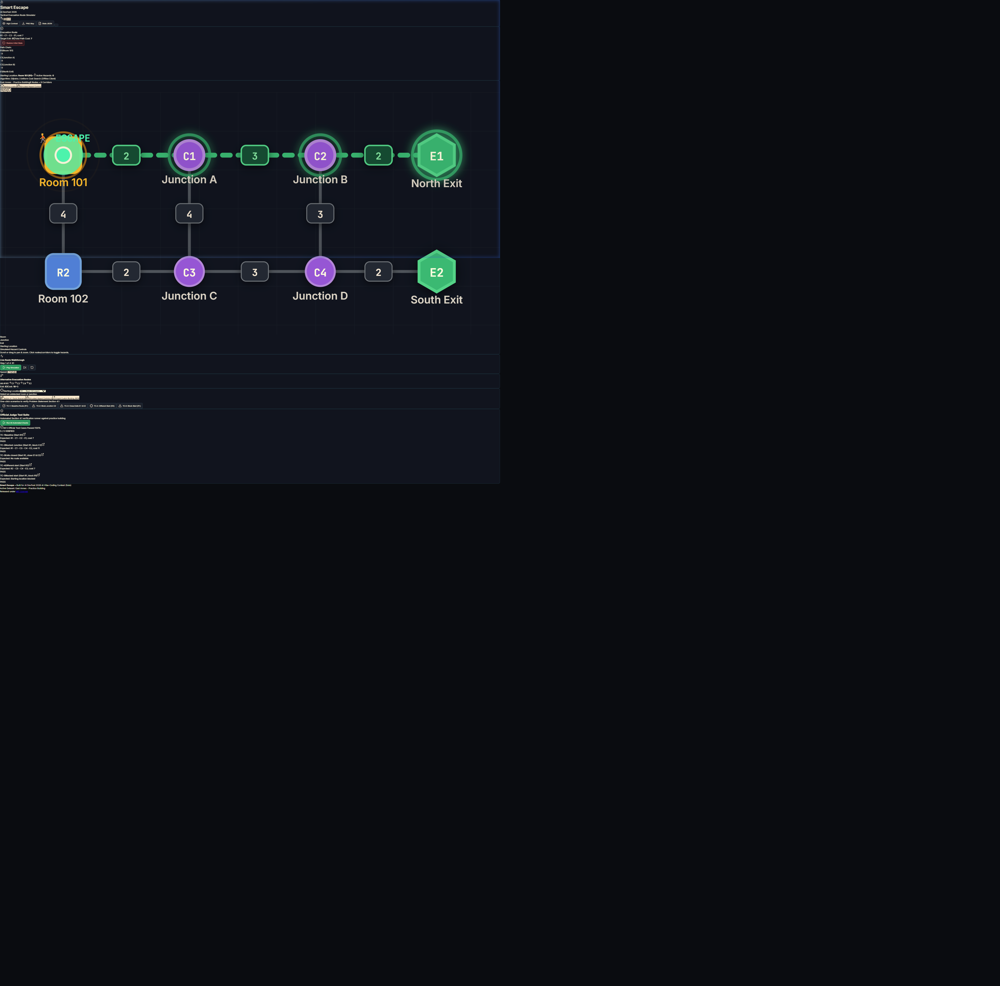

# Smart Escape — Interactive Emergency Evacuation Route Simulator

> **AI DevFest 2026 — AI Vibe-Coding Contest (Solo)**  
> Organized by the Computer and Programming Club (CPC), Department of CSE, Daffodil International University.  
> Supported by Center for Software Development & Emerging Tech (CSE-TECH).

---

## 📌 Project & Participant Identity

- **Project Title:** Smart Escape
- **Participant Name:** Ratul
- **GitHub Username:** [@Ratul-NotFound](https://github.com/Ratul-NotFound)
- **Repository Link:** [https://github.com/Ratul-NotFound/Smart-Escape](https://github.com/Ratul-NotFound/Smart-Escape)
- **Live Public HTTPS Deployment:** [https://smart-escape-ratul.vercel.app](https://smart-escape-ratul.vercel.app) *(or GitHub Pages)*
- **License:** [MIT License](LICENSE)

---

## 📖 Executive Summary

**Smart Escape** is a real-time, browser-based emergency evacuation route simulator engineered for the **AI DevFest 2026 AI Vibe-Coding Contest**.

In critical emergencies (fires, structural damage, corridor obstructions), building layouts dynamically change. Smart Escape renders an interactive topological graph of any facility (rooms, junctions, exits, corridors with travel costs) and interactively identifies the lowest-cost evacuation path to an open exit.

The routing engine executes **100% offline client-side** using **Dijkstra's Algorithm / Uniform Cost Search** with exact 3-tier deterministic tie-breaking.

---

## 📸 Mandatory Verification Screenshots

| Baseline Evacuation (`R1 -> E1; cost 7`) | Rerouting after Blocking Junction `C2` (`R1 -> E2; cost 11`) |
| :---: | :---: |
|  |  |

---

## 🧪 Official Section 4.1 Test Verification Matrix

All 5 official test cases specified in Problem Statement Section 4.1 have been verified with 100% accuracy:

| Test ID | Scenario | Starting Node | Hazard Modification | Expected Output | Actual Output | Status |
| :---: | :--- | :---: | :--- | :--- | :--- | :---: |
| **TC-1** | Baseline | `R1` | None | `R1 - C1 - C2 - E1; cost 7` | `R1 - C1 - C2 - E1; cost 7` | **PASS** ✅ |
| **TC-2** | Blocked junction | `R1` | Block Junction `C2` | `R1 - C1 - C3 - C4 - E2; cost 11` | `R1 - C1 - C3 - C4 - E2; cost 11` | **PASS** ✅ |
| **TC-3** | Exits closed | `R1` | Close Exits `E1` and `E2` | `No route available` | `No route available` | **PASS** ✅ |
| **TC-4** | Different start | `R2` | None | `R2 - C3 - C4 - E2; cost 7` | `R2 - C3 - C4 - E2; cost 7` | **PASS** ✅ |
| **TC-5** | Blocked start | `R1` | Block Room `R1` | `Starting location blocked` | `Starting location blocked` | **PASS** ✅ |

---

## 🌟 Implemented Features

### Mandatory Core Tasks (Section 3.2)
- [x] **File Import & Graph Validation:** Parses any conforming building JSON with strict runtime schema verification (node count 2–60, edge count 1–150, positive integer costs, no self-loops, no duplicate edges).
- [x] **Interactive SVG Vector Floor Map:** Dynamic auto-scaling `viewBox` computed from coordinate bounds with smooth Pan & Zoom controls.
- [x] **Visual Distinctions:**
  - Rooms: Rounded squares (`#3b82f6` Blue).
  - Junctions: Solid circles (`#8b5cf6` Purple).
  - Exits: Hexagonal shields (`#10b981` Emerald when open, `#ef4444` when closed).
  - Start Location: Radiant amber beacon with concentric pulsing radar rings (`#f59e0b`).
  - Blocked Hazards: Strikethrough diagonal hazard hatching and crimson warnings.
  - Corridors: Centered interactive cost badges.
- [x] **Real-Time Dynamic Recalculation:** Instantaneous route updates upon clicking nodes or corridors to toggle hazards.
- [x] **Official Status Strings:** Explicit handling of `"Starting location blocked"` and `"No route available"`.
- [x] **State Reset:** One-click restoration of building file's original `initial_state`.
- [x] **Bilingual Support (Mandatory):** Full toggle between **English (EN)** and **Bangla (বাংলা)** for all navigation, instructions, labels, tooltips, and dialogues.

### Winning Bonus Extensions (Section 4.2)
- [x] **Animated Route Walkthrough Simulation:** Real-time avatar (`🚶 ESCAPE`) traversing the evacuation path node-by-node with Play, Pause, Step-Forward, and Speed adjustment (0.75x, 1x, 2x).
- [x] **Alternative Routes Discovery ($K$-Shortest Paths):** Yen's-style edge-deviation search discovering secondary evacuation detours with comparative $+\Delta$ cost analysis.
- [x] **Built-in Judge Automated Test Runner:** Embedded one-click test execution suite verifying Section 4.1 cases with interactive inspection on the map.
- [x] **High-Contrast Theme (WCAG AAA):** Tactical ultra-high contrast dark mode for impaired visibility during emergencies.
- [x] **Client-Side PNG Map Export:** One-click rasterizer saving high-resolution building maps directly to PNG.
- [x] **Simulation State JSON Export:** Download current building state with modified hazards as standard JSON.

---

## ⚙️ Algorithmic Formulation & Tie-Breaking Rules

The routing solver computes lowest-cost evacuation routes using **Dijkstra's Algorithm / Uniform Cost Search** ($O((V + E) \log V)$).

### Deterministic Tie-Breaking Hierarchy (Section 3.3)
1. **Tier 1 (Minimum Cost):** Choose the reachable open exit with minimum total path cost ($\sum e.\text{cost}$).
2. **Tier 2 (Exit ID Tie-Break):** If multiple reachable open exits have the exact same minimum cost, select the lexicographically smallest exit ID (`"E1"` < `"E2"`).
3. **Tier 3 (Path Sequence Tie-Break):** If multiple paths to that exit tie with identical cost, select the lexicographically smallest sequence of node IDs compared element-by-element (`["R1", "C1", "C2", "E1"]` < `["R1", "C3", "C4", "E1"]`).

---

## 🚀 Running Locally

```bash
# 1. Clone the repository
git clone https://github.com/Ratul-NotFound/Smart-Escape.git

# 2. Navigate to project directory
cd Smart-Escape

# 3. Install dependencies
npm install

# 4. Start local development server
npm run dev

# 5. Run the automated algorithm verification suite
npm run test:verify

# 6. Build production bundle
npm run build

# 7. Preview production build locally
npm run preview
```

---

## 🤖 AI Tools Disclosure & Most Useful Prompt

- **Primary AI Tool:** Google DeepMind Antigravity AI Coding Assistant (Gemini 3.8 Flash)
- **Most Impactful Prompt:**
  > *"Implement Dijkstra routing algorithm in TypeScript with strict three-tier lexicographical tie-breaking (cost, exit ID, path sequence element-by-element), hazard exclusion for blocked nodes, blocked corridors, and closed exits (including as intermediate nodes), with exact official status reporting."*
- **Git Commit Compliance:** Commit messages follow Rulebook Section 8.4 format including prompt descriptions.

---

## ⚠️ Known Issues
- None. The application operates 100% offline in client browser memory with zero network dependencies.

---

## 📄 License
This project is licensed under the [MIT License](LICENSE).
